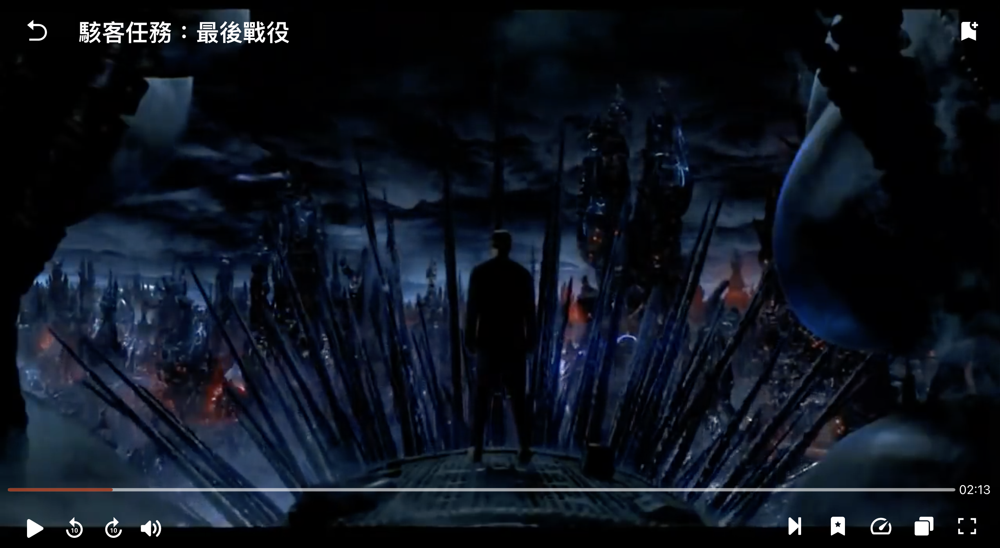

# Dora Video Player

## Introduction

Demo Link : [Dora Video Player >>](https://dora-video-player.web.app)

Functions
- Get back to homepage arrow
- Add bookmark
- Play / Pause
- Backward 10 sec
- Forward 10 sec
- Adjust volume
- Next episode
- Bookmark collector
- Adjust Speed
- Select other episodes 
- Adjust fullscreen

## Plugins
- firebase: ^8.10.0
- react-router-dom: ^6.2.1
- styled-components: ^5.3.3
- react-icons: ^4.3.1

